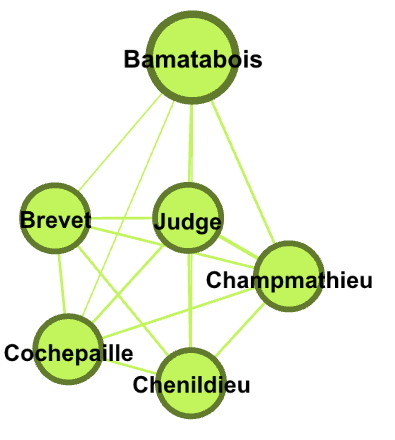
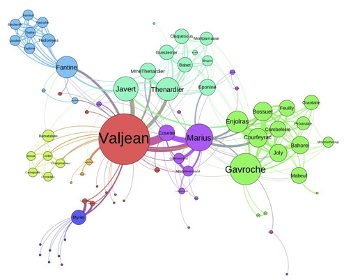

```{r setup, include=FALSE, echo=FALSE}
# ***** To get started, click on the triangle above right *****
# ***** to run the "r setup" for this document.           *****
require("knitr")
opts_chunk$set(echo = TRUE) # make code available by default
library(igraph)
library(tibble) # for nice tables 
# Used to include images 
library(jpeg)
library(png)
# Utilities for plotting degree distributions 
source("Utility/degree_domain.R")
source("Utility/nonzero_degree_distribution.R")
```

### R Markdown

This is an R Markdown document, with extension .Rmd, which R Studio knows how to interpret. We will use Rmd documents as templates for your homework in R, so that everyone has the same layout and it is easier to grade. (We will sometimes use Google Doc templates for your work in Gephi.) 

The document begins with a YAML header giving parameters for document formatting, followed by a setup "code chunk" that initializes the R environment for this document. I'll explain them in class. In general you will only need to modify the 'library' imports and add 'source' as needed in the code chunk.  Click on the triangle in the upper right of the code chunk to run it. 

Markdown is a simple formatting syntax for authoring various kinds of documents, including HTML, PDF and MS Word. The above header marked by ### and this paragraph are examples. We can make items *italic* or **bold** or make lists: 

* an item
* another item.

Select Preview from the Knit menu to see the results. 

R Markdown adds embedded R code that is evaluated to add output to the document. For more details on using R Markdown see <https://rmarkdown.rstudio.com/lesson-1.html> or the cheatsheet <https://github.com/rstudio/cheatsheets/blob/main/rmarkdown.pdf>. 

### Reproducible Research and Notebooks 

Beyond this class, the bigger motivation for using R Markdown notebooks is communication of research results.

* A notebook combines text and code so you can explain your code and interpret the results in the same document as the code. We could just put comments like I do in my .R scripts, but they can't be formatted nicely, and more importantly ... 
* A notebook enables you to give everything you used to get your results to someone else, who can run it again. The folder the notebook is in has all required files, and the recipient of your notebook can inspect and even change the analysis. 

Then why not use notebooks for everything? I use plain R scripts for exploratory work and classroom demonstrations, as they are syntactically simple (I just want to focus on the R, not on presentation in R Markdown). Also we frequently use ?documentation calls during exploratory development, which don't work well in .Rmd. We reserve Rmd for presenting the work once it is done.

### R Chunks 

You start an R chunk with three backquotes followed by {r} and end it with three more backquotes, like the following. Clicking on the triangle at the right executes the code in your editor and shows the results: 

```{r}
data(cars)    # loads a predefined demonstration data set 
summary(cars)
```

### Reading Files 

#### Working Directory is the Containing Folder

In my class demos, we always start each script with a setwd(...) to set the working directory to your directory. We do not do this in R Markdown for two reasons. First, a setwd is active only in the code chunk in which it is executed. If you want to set a working directory globally you can use opts_knit$set(root.dir=...) in the setup code chunk, but I *do not recommend that you do that* for the second reason: The default directory will be the directory that this .Rmd file is in. I recommend that you make a folder for each assignment or project, put your .Rmd in it, and organize other materials (data, images, etc.) as subfolders in this folder. Then you can move that folder wherever you want or even zip it up and send it to a colleague without breaking the relative path names.

#### Reading a Network 

This file should be in a folder with a subfolder "Networks" containing Les-Miserables.graphml. Let's check that it is there: 
```{r}
dir("Networks")
```

Here we read in Networks/Les-Miserables.graphml and print its summary: 

```{r}
LM <- read_graph("Networks/Les-Miserables.graphml", format="graphml")
summary(LM)
```

### Including Plots and Tables 

You can embed plots, for example:

```{r}
plot(LM, main = "Les-Miserables Co-Appearance", 
     vertex.size = 10, 
     vertex.color = "white",
     vertex.label.cex = 0.4)
```

In the following example we combine two visualizations: a plot of the degree distribution of the LM graph, and a table of the characters in terms of the number of other characters they appear with in scenes (which is equivalent to vertex degree). We construct a tibble (a type of data frame) of the label and degree of each vertex and sort it by degree (partners) before displaying it. 

```{r}
plot(degree_domain(LM),
     nonzero_degree_distribution(LM),
     main="Les-Miserables Degree Distribution", 
     xlab="k", ylab="p(k)")
num_partners <- tibble(character=V(LM)$label, partners=degree(LM)) # make the table
num_partners[order(num_partners$partners, decreasing=TRUE),]       # sort by degree
```

As you can now see, if more than one table or plot is in a code chunk, R Studio will provide a visual index that lets you select between them, but documents output as HTML or PDF will display them in sequence. Also, it will display tables 10 rows at a time. 

### Adding Your Own Code 

An easy way to add a new chunk is option-command-i, or you can use the menu item Code / Insert Chunk. Try that here and put in some code, for example to print out the $label on the LM vertex of maximum degree, similar to last week's exercise: 

Replace this with code chunk! 

### Including Bitmap Images and PDF from Gephi

Many assignments will include work in Gephi. If the assignment only requires Gephi (not R), then I will provide a Google Doc template for your response. If the assignment also includes R, we would like to collect work in both environments into one document. Fortunately there are ways to include externally generated bitmap images and PDF into R Markdown generated PDF (demonstrated below), so we will use R Markdown as the main document to collect your responses into one document. 

Suppose that a question asks you to visualize the entire network, and then to interpret parts of the network. (For example, in the Analysis 1 assignment you are asked to visualize Political Blogs, and then to zoom in to show the blogs that bridge left and right). The full visualization will be large, so I ask that you include them as separate PDF files. The zoomed in images can and should be embedded in the document where they are discussed. 

#### Embedding Bitmap Images 

Here, I include JPG of a screen dump I made of the characters involved in a trial, as an example of embedding a zoomed in image. I generated this visualization in Gephi by applying a filter, using the Camera icon 'Take screenshot", and then using image editing software to crop the resulting PNG and save as JPG.  

In the above examples, the code used to generate the output is echoed to the output. We can control this by setting echo=FALSE (or TRUE) in the R markup, as {r echo= FALSE}. Here we set echo=FALSE for a cleaner display: 

```{r echo=FALSE}

``` 

#### PDF From Gephi 

It is possible to embed PDF from other sources in PDF created by Knitr, but not in HTML. We will take a simpler approach: Provide PDF from Gephi as separate files and reference them here, for example by saying ... 

**See Images/LeMis.pdf. Here is a preview:**

```{r echo=FALSE}

```


### Generating the Final Documents

Once you are sure the code chunks are working correctly, you can generate HTML or PDF using the Knit menu. Try HTML and PDF now! Notice the differences in what is displayed and where it is located. 

Knit to HTML has the huge advantage that one can click on "Code" buttons to see the code that generated the output, as well as seeing the output without rerunning the code. We will do all of our grading using the HTML version of your work, except that we will examine external PDF files separately. 

That is the end of this demonstration! 
